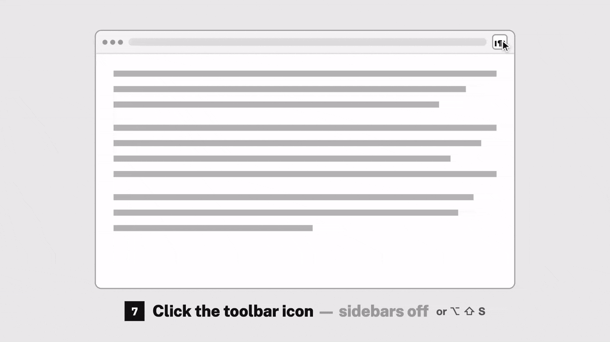

<h1 align="center">Pillarbox</h1>

A Chrome extension that squeezes a page's content left/right/inward using two resizable sidebars.

  
  

## Gestures

| To do this                            | Try                                                                                      |
| ------------------------------------- | -------------------------------------------------------------------------------------------- |
| Turn the sidebars on or off           | **Click** the toolbar icon, or **press** `Alt+Shift+S` (rebind it at `chrome://extensions/shortcuts`) |
| Resize one side                       | **Drag** the sidebar edge                                                                        |
| Center the page and resize both sides | **Hold** any modifier key (Shift, Ctrl, Alt or ⌘) and **drag**                                      |
| Collapse one side                     | **Double-click** it                                                                              |
| Bring a collapsed side back           | **Drag** from the page edge or double-click the edge                                             |
| Bring both collapsed sides back       | **Click** the toolbar icon                                                                       |
| Return to your default widths         | **Hold** any modifier key and **double-click** a sidebar                                             |

## Good to Know

> [!WARNING]
> Tabs already open when you install or update the extension still
> toggle, but reshape correctly only after you reload them.

> [!TIP]
> Go to the extension **Options** page to set default widths, the theme, the
> sidebar colors, a pixel readout while dragging, and the shortcut.

> [!TIP]
> Set **per-URL rules** in the **Options** page: Match URLs by **substring**
> or **regex**, and set default widths or let the extension automatically open
> sidebars

> [!NOTE]
> Each page remembers itself: Whether the
> sidebars are on and how wide they are comes back on every visit until you
> toggle it off.

> [!WARNING]
> Some things escape: unbreakable content (code blocks, wide tables), small
> fixed elements like chat buttons, bars centered by hand rather than by layout,
> breakpoints inside web components, and cross-origin stylesheets served over
> plain HTTP.

> [!WARNING]
> `chrome://` pages, the Web Store and the PDF viewer are Chrome's own and
> sidebars cannot be inserted. The extension icon flashes a red ✕ there.

## Install From Source

1. Open `chrome://extensions` and turn on **Developer mode** (top right).
2. Click **Load unpacked** and pick this folder.
3. Pin the icon, then click it on any page.

## For Developers

See **[DEVELOPERS.md](DEVELOPERS.md)** for the architecture, how the squeeze is
actually implemented, the storage schema, and how to run the tests.

