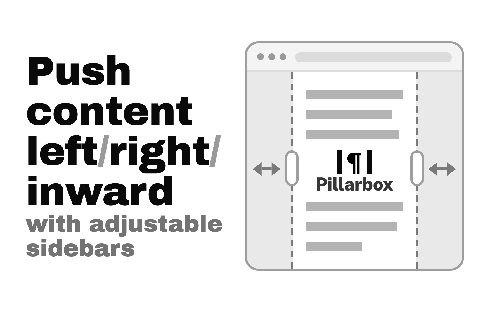
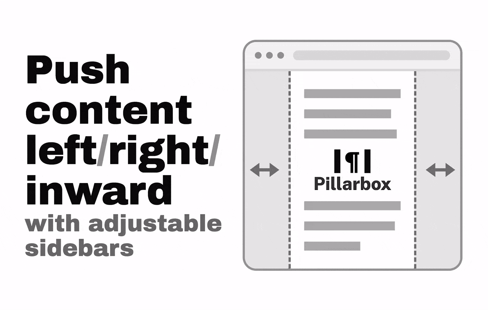

# Pillarbox

A Chrome extension that squeezes a page's content left/right/inward using two resizable sidebars.

_Click the preview to open the full animation._

## Install From Source

1. Open `chrome://extensions` and turn on **Developer mode** (top right).
2. Click **Load unpacked** and pick this folder.
3. Pin the icon, then click it on any page.

## Gestures

| To do this | Do that |
| --- | --- |
| Turn the sidebars on or off | Click the toolbar icon, or press `Alt+Shift+S` (rebind it at `chrome://extensions/shortcuts`) |
| Resize one side | Drag the sidebar edge |
| Center the page and resize both sides at once | Hold any modifier key (Shift, Ctrl, Alt or ⌘) and drag — the far side matches the one you drag, so the page centers the moment you press the key and both sides resize together from there. Let the key go mid-drag and the far side glides back to where it started. Hold the key while just resting on an edge and both edges light up, showing what the drag would link |
| Collapse one side | Double-click it |
| Bring a collapsed side back | Drag from the page edge or double-click the edge |
| Bring both collapsed sides back | Click the toolbar icon — with both sides collapsed it revives them at your default widths instead of toggling off |
| Return to your default widths | Hold a modifier and double-click a sidebar |

## What it remembers

Each page — the exact URL, ignoring `#anchors` — remembers whether the
sidebars are on and how wide they are, and restores that on every reload and
future visit until you toggle it off. Nothing to save; it just sticks.

Sidebar widths are also zoom-stable: a sidebar stays the same size on screen
at any zoom level, so zooming resizes the page's text, not your pillars.

## Options

Right-click the icon → **Options**. You can set the default widths, the theme
(Auto / Light / Dark) and the sidebar colors, turn on a pixel readout while
dragging, and change the keyboard shortcut. **SHIFT JAVASCRIPT BREAKPOINTS**
is what makes YouTube-style apps reshape under the squeeze; leave it on unless
some site's scripts misbehave while squeezed.

You can also write **per-URL rules**: a URL pattern gets its own default
widths, which apply the first time you enable that page and whenever you reset
it. Click a rule's **MATCH BY** cell to choose how its pattern is compared —
**substring**, where you can paste a URL straight out of the address bar, or
**regex** for anything cleverer. Three ship out of the box (nature.com
articles, zhihu questions, YouTube watch pages) and are ordinary rules — edit
or delete them freely.

**NEW PAGE BEHAVIOR** decides what a matching page does on its own. Leave it on
**DO NOTHING** and the page waits for you to open it; switch it to **SHOW
PILLARS** and every matching page you have not touched yet opens with its
pillars already in place, at that rule's widths. "Not touched yet" is the whole
of it — the moment you resize or toggle a page, that page remembers its own
answer and the rule stops deciding for it. Turning the pillars off on a page
sticks, rule or no rule.

The shipped zhihu rule comes set to **SHOW PILLARS**, so zhihu question pages
open squeezed out of the box; the other two ship on **DO NOTHING**. Switch it
off — or delete the rule — if you would rather nothing opened by itself.

## Good to know

- Sites adapt to the squeeze: their responsive breakpoints — stylesheet media
  queries, the `matchMedia` checks apps make from JavaScript, and the window
  widths their scripts measure (YouTube's layout switching and player sizing,
  for one) — all see the narrowed width, so a page reflows into the same
  layout it would use in a window of that size instead of overflowing. A page
  with a hard minimum width shows a horizontal scrollbar.
- Wide, unbreakable content (code blocks, wide tables) can still run under a
  sidebar, and the occasional app that measures the screen itself (rather
  than the window) may still ignore the squeeze.
- Small fixed elements — chat buttons, side drawers — are left where they are
  and may sit partly under a sidebar.
- On public pages, cross-origin stylesheets served over plain HTTP keep their
  native breakpoints; HTTPS is required before Pillarbox will relay and shift
  an otherwise unreadable stylesheet.
- Fullscreen video is unaffected, and printing temporarily un-squeezes the page
  so printouts come out clean.
- Running on `file://` pages needs "Allow access to file URLs" in
  `chrome://extensions`.

## Development

See **[DEVELOPERS.md](DEVELOPERS.md)** for the architecture, how the squeeze is
actually implemented, the storage schema, and how to run the tests.
